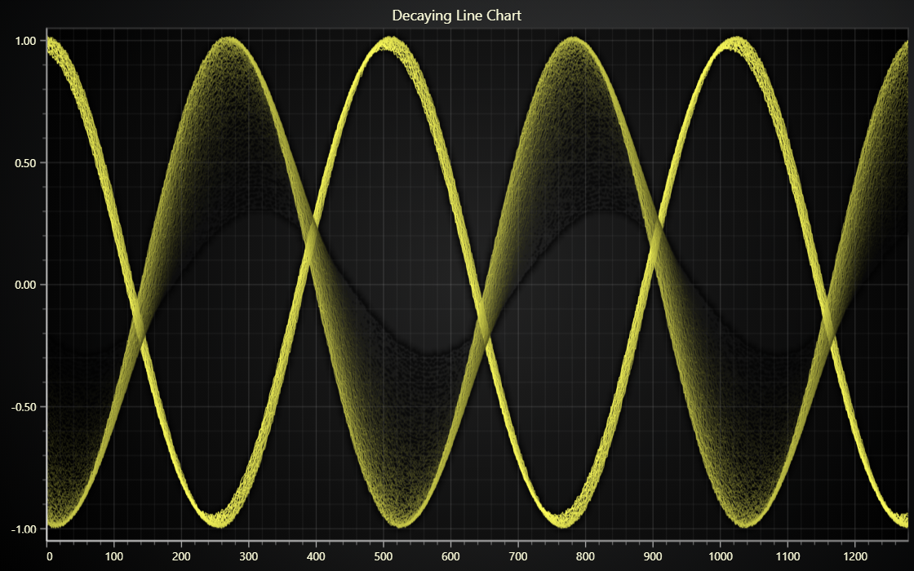

# JavaScript Decaying Line Chart

This demo application belongs to the set of examples for LightningChart JS, data visualization library for JavaScript.

LightningChart JS is entirely GPU accelerated and performance optimized charting library for presenting massive amounts of data. It offers an easy way of creating sophisticated and interactive charts and adding them to your website or web application.

The demo can be used as an example or a seed project. Local execution requires the following steps:

-   Make sure that relevant version of [Node.js](https://nodejs.org/en/download/) is installed
-   Open the project folder in a terminal:

          npm install              # fetches dependencies
          npm start                # builds an application and starts the development server

-   The application is available at _http://localhost:8080_ in your browser, webpack-dev-server provides hot reload functionality.

## Description

This example showcases a refreshing line chart application, where some amount of previous samples are left visible for a brief moment.

Older samples are constantly updated with increasing transparency colors to give a "decaying" effect.

This effect is achieved by preparing an individual `LineSeries` for each displayed sample and updating the stroke style on every update.
Updating stroke style is a really fast operation, and there isn't any particular limit to the number of series either, so the amount of data in this kind of application can be scaled quite far up.

## API Links

* [XY cartesian chart]
* [Line series]
* [Solid line style]
* [Color factory RGBA]

## Support

If you notice an error in the example code, please open an issue on [GitHub][0] repository of the entire example.

Official [API documentation][1] can be found on [LightningChart][2] website.

If the docs and other materials do not solve your problem as well as implementation help is needed, ask on [StackOverflow][3] (tagged lightningchart).

If you think you found a bug in the LightningChart JavaScript library, please contact support@lightningchart.com.

Direct developer email support can be purchased through a [Support Plan][4] or by contacting sales@lightningchart.com.

[0]: https://github.com/Arction/
[1]: https://lightningchart.com/lightningchart-js-api-documentation/
[2]: https://lightningchart.com
[3]: https://stackoverflow.com/questions/tagged/lightningchart
[4]: https://lightningchart.com/support-services/

© LightningChart Ltd 2009-2022. All rights reserved.

[XY cartesian chart]: https://lightningchart.com/js-charts/api-documentation/v4.2.0/classes/ChartXY.html
[Line series]: https://lightningchart.com/js-charts/api-documentation/v4.2.0/classes/LineSeries.html
[Solid line style]: https://lightningchart.com/js-charts/api-documentation/v4.2.0/classes/SolidLine.html
[Color factory RGBA]: https://lightningchart.com/js-charts/api-documentation/v4.2.0/functions/ColorRGBA.html

